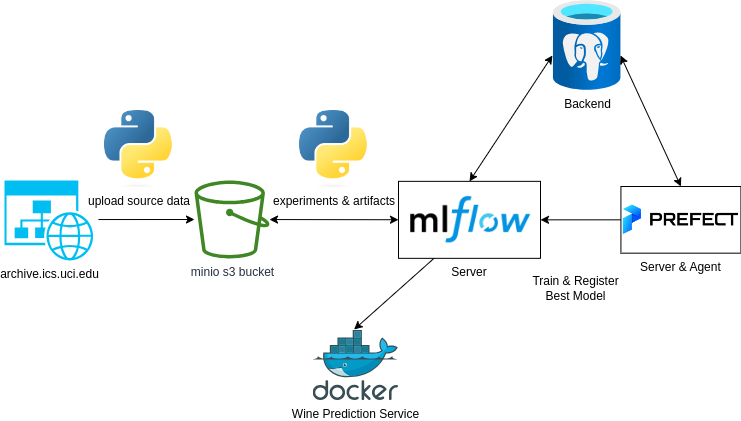

# Wine Quality Prediction

## Source Data
The [dataset](https://archive.ics.uci.edu/dataset/186/wine+quality) used in the project is red wine quality scores of the Portuguese *"Vinho Verde"* and their corresponding physicochemical tests.

## Problem Statement
This project tries to emulate the machine learning production environment for the RandomForestClassifier model, which tries to predict the quality of the red wine based on its physicochemical characteristics. The architecture is presented on the following figure:



Figure 1. General Architecture

All listed services are running in separate docker containers.

Initially, the dataset is downloaded via python script from the website as a zipfile. The script unpacks the red wine csv file and loads it to the minio s3 bucket. Jupyter lab container is used for initial experiments and hyperparameter optimization. These scripts are stored in ```./jupyter/``` folder.

All these experiments are logged by the MLflow server. Prefect deployment is used to orchestrate the selection and training of the best available model, which is promoted to the model registry. For this purpose two docker containers are used to run local prefect server and prefect agent. Prefect deployment and model artifacts are stored in the minio s3 bucket.

Wine prediction service is a docker container with the best red wine quality prediction model served from the MLflow model registry.

Dataset drift and model quality metrics are gathered by Evidently and visualized in Grafana.

Postgres is used as a backend database for MLflow, Prefect & Grafana services.

## Stack
Main features of this project are:
- all services are running in local docker containers;
- MLflow is used for experiment tracking and registration of the best models;
- Prefect workflow deployment orchestrates the choice of the model for the model registry;
- grafana and evidently are used for basic model monitoring;
- prediction model is containerized with ```/predict``` endpoint;
- pylint is used as the main linter.

## How to run all this stuff
- run ````ocker-compose build``` in the root folder;
- run ```docker-compose up -d``` in the root folder;
- open http://localhost:9001 in your browser;
- login to the minio portal and create a new bucket via Buckets -> Create Bucket button with name *"mlflow-artifacts"*;
- create access keys via Access Keys -> Create access key button;
- copy Access Key ```MINIO_ACCESS_KEY``` and Secret Key ```MINIO_SECRET_KEY``` to the existing .env file;
- run ```docker-compose down``` and ```docker-compose up -d``` to re-initialize new minio API keys.

### Jupyter
- to open jupyter you need to reach http://localhost:8888/lab in your browser.
- open ```./jupyter/main.ipynb``` and run the download_data.py cell. It will pull the zip file with data and save it to the "mlflow_artifacts" bucket;
- *optional* step: run ```./jupyter/explore_features.ipynb``` if you want to understand the idea behind chosen features;
- *optional* step: run ```./jupyter/initial_models.ipynb``` to see the performance of the 4 main classification models with default parameters;
- in ```./jupyter/main.ipynb``` run ```!python ./scripts/hpo.py``` cell for hyperparameter optimization.

### Prefect
The model could be promoted to the model registry in two ways:
- run ```!python ./scripts/register_best_model.py``` cell for manual prefect flow registration OR
- run ```!python ./scripts/register_minio_block.py``` and ```!prefect deployment build``` cells for scheduled prefect flow deployment.
Either way you'll end up with the following prefect flow:


Figure 2. Prefect flow

This flow consists of three steps:
- *"Prepare Data"* downloads file from s3 bucket and splits dataset into training and validation parts;
- *"Get Parameters"* pulls the parameters of the best model from hyperparameter optimization experiment;
- *"Register Best Model"* trains the model, logs its artifacts and promotes it to the model registry.

### Testing
There is an integration test for prediction service. In order to run the tests you'll need to:
- navigate to ```./installation/deployment_files``` folder;
- install the developer packages via ```pipenv install --dev``` or ```pipenv sync```;
- activate the pipenv environment with ```pipenv shell```
- run ```pytest``` command.

## Known issues
On linux ds-notebook container might not start because of privileges issue. If you encounter this problem you need to change ownership of the jupyter folder to the docker user with the command ```sudo chown -R 100999:100099 ./jupyter```.

#### TODO
- add minio bucket creation container;
- rewrite minio section;
- add grafana monitoring.